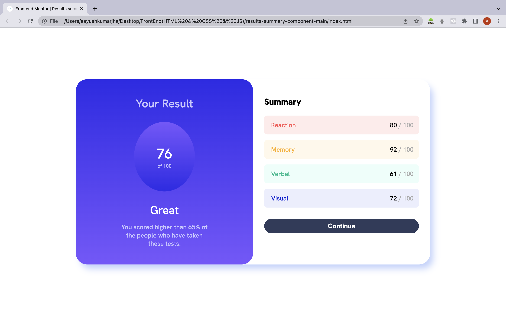
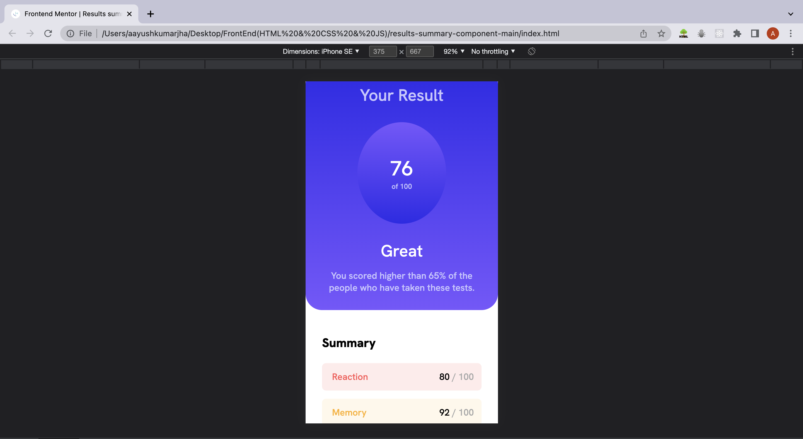

# Frontend Mentor - Results summary component solution

This is a solution to the [Results summary component challenge on Frontend Mentor](https://www.frontendmentor.io/challenges/results-summary-component-CE_K6s0maV).

## Table of contents

- [Overview](#overview)
  - [The challenge](#the-challenge)
  - [Screenshot](#screenshot)
  - [Links](#links)
- [My process](#my-process)
  - [Built with](#built-with)
  - [What I learned](#what-i-learned)
- [Author](#author)
- [Acknowledgments](#acknowledgments)

## Overview

### The challenge

Users should be able to:

- View the optimal layout of the component for desktop and mobile.
- See hover for all interactive elements on the page.

### Screenshot

### Links

- Solution URL: [View the source code](https://github.com/Aayush895/Results-Summary-Component)
- Live Site URL: [Live Site Link](https://aayush895.github.io/Results-Summary-Component/)

## My process

### Built with

The component was built with the help of following tools:
- Semantic HTML5 markup
- CSS custom properties
- Flexbox
- CSS Grid
- Mobile-first workflow

### What I learned

While I was working on this project I learned about the basics of `css grids` and how to use it to make a basic component layout like this one. I also learned about `media queries` and how to use it, to make my designs compatible with different devices like mobile phones and tablets. But since this was a relatively friendly project I was able to complete it with relative ease.

## Author

- Website - [Aayush Kumar Jha](https://www.linkedin.com/in/aayush-jha-6716b018b/)
- Frontend Mentor - [@Aayush895](https://www.frontendmentor.io/profile/Aayush895)
- Twitter - [@JhaAayush895](https://twitter.com/JhaAayush895)

## Acknowledgments

I would like to thank frontend mentor for providing an amazing platform where beginners like me can come and refine our skills on front-end web devlopment and also for providing such an open community where we can get feedback from other folks who are experienced in this field.

